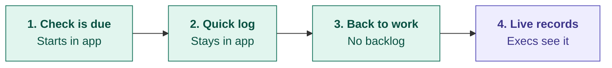

# Future-State Journey: Compliance Logging in RouteLogic

> **Note:** This future state is built on a hypothetical persona and is pending validation through targeted coordinator interviews.

## Context

**Persona:** A real-time fleet coordinator who keeps daily operations running and is responsible for logging compliance checks during her shift.

**Goal:** To keep compliance records up to date in RouteLogic without slowing down the operations she coordinates.

**Strategy:** Reclaim operational simplicity by stripping away legacy noise and ensuring the tool is the fastest for everyday work.

**Value Proposition:** For real-time fleet coordinators, we will allow them to register compliance checks within RouteLogic, keeping advanced enterprise features available but out of their way, because this process is an administrative burden that affects real-time operations and the statistics the executive team uses to make decisions now, giving competitors an opportunity to win our biggest account.

## Visual Timeline

*Teal: coordinator experience. Purple: executive outcome.*

## Stages

1. **Check is due**
   - **User Action:** Opens compliance logging from her daily workspace → starts without searching through menus.
   - **Internal State:** Feels time pressure → trusts the task will fit her shift.
   - **Pain Point Addressed:** Compliance logging buried under enterprise features she rarely uses.

2. **Quick log**
   - **User Action:** Completes the compliance check inside RouteLogic → finishes before operations pull her away.
   - **Internal State:** Stays focused on the task → no urge to switch to a spreadsheet.
   - **Pain Point Addressed:** The four-screen flow that pushed her out at the fourth screen.

3. **Back to work**
   - **User Action:** Confirms the check is saved → returns to operations with nothing pending.
   - **Internal State:** Feels relieved → no checks left to transfer later.
   - **Pain Point Addressed:** Shadow spreadsheet log and later manual re-entry into RouteLogic.

4. **Live records**
   - **User Action:** Moves on to her next task → compliance records are already available to executives.
   - **Internal State:** Trusts RouteLogic as the system of record → stops keeping backups.
   - **Pain Point Addressed:** Late compliance records and the executives' lost real-time view.

## Competitive Advantages Over the Manual Workaround

1. **Single entry:** Each check is logged once, eliminating duplicate work and manual transfer.
2. **Real-time data:** Compliance records reach RouteLogic immediately, keeping executive reporting current.
3. **One system of record:** Data stays inside RouteLogic, removing the shadow spreadsheet and its risk of omissions.
