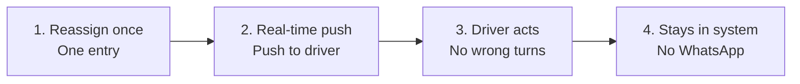

# Future-State Journey: Real-Time Route Reassignment

**Persona:** A fleet dispatcher at a mid-size 3PL (UXR-02)
**Goal:** To reassign routes and have drivers act on the change right away.
**Friction:** "I reassign a route and the driver doesn't see it for ten, fifteen minutes. By then they've driven the wrong way. We keep a WhatsApp group as the real system."

**Strategy:** Reclaim operational simplicity by stripping away legacy noise and ensuring the tool is the fastest for everyday work.

**Value proposition:** For the dispatcher who needs a route reassignment to reach the driver immediately, we will deliver the change to the driver's app in real time with a push notification, so that she can stop relying on a WhatsApp group to coordinate the fleet, because every reassignment that lags ten to fifteen minutes sends a driver the wrong way and keeps coordination happening outside the system.

---

## Timeline

---

## Stages

### 1. Reassign once
- **User action:** Reassigns the route in RouteLogic → one entry, no parallel WhatsApp message.
- **Internal state:** Confident the system will deliver it → no need to double-check elsewhere.
- **Pain point addressed:** Coordination duplicated in WhatsApp → the platform does the job (UXR-02).

### 2. Real-time push
- **User action:** Sends the reassignment → driver's app updates instantly with a push notification.
- **Internal state:** Relieved the driver knows now → no waiting, no chasing.
- **Pain point addressed:** The 8–15 minute lag with no notification → removed (BUG-2044).

### 3. Driver acts
- **User action:** Relies on the in-app notification → no follow-up call or message needed.
- **Internal state:** In control of the fleet → decisions take effect immediately.
- **Pain point addressed:** Drivers acting on stale routes → no more driving the wrong way (UXR-02, BUG-2044).

### 4. Stays in system
- **User action:** Handles the next change in RouteLogic → the WhatsApp group isn't needed.
- **Internal state:** Trusts the tool as the real system → one place to coordinate.
- **Pain point addressed:** WhatsApp as "the real system" → coordination returns to the platform (UXR-02).

---

## Competitive Advantages Over the WhatsApp Workaround

1. **Single entry:** The reassignment is made once → no duplicate messaging in a separate chat.
2. **The route itself reaches the driver:** The updated route lands in the app → no chat message to read and interpret.
3. **The platform stays the system of record:** Every change is tracked in RouteLogic → the reporting customers bought it for stays complete (UXR-10).

---

## Scope Note

This journey covers the dispatch-to-driver direction only, matching the value proposition. The reverse direction, where driver status reaches the dispatcher dashboard 20–60 minutes late (BUG-2072), is outside this initiative.
